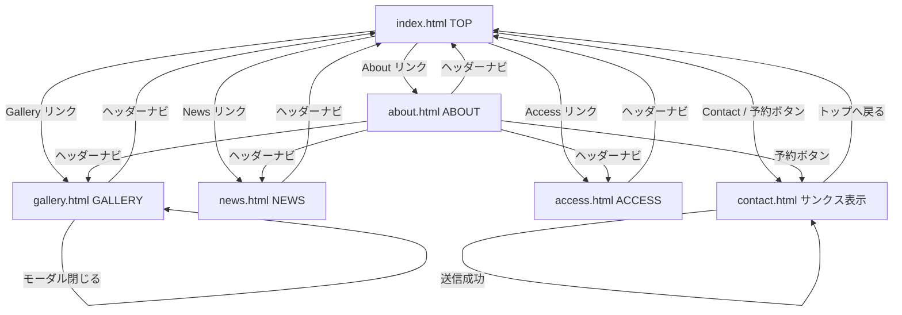

# LAKOTA HOUSE モックサイト 設計書

## 1. システム概要

本サイトは、宿泊施設「LAKOTA HOUSE」のブランドサイト風静的モックサイトです。  
外部サーバー不要の純粋な HTML/CSS/JS で構成されており、`file://` プロトコルでも動作します。

---

## 2. ファイル構成図

```
test_20260422/
├── index.html          # TOPページ
├── about.html          # コンセプト/Aboutページ
├── gallery.html        # ギャラリーページ
├── news.html           # お知らせ一覧ページ
├── access.html         # アクセスページ
├── contact.html        # お問い合わせフォームページ
├── css/
│   └── style.css       # 全ページ共通スタイル
├── js/
│   └── main.js         # 共通JavaScript
├── docs/
│   ├── design.md       # 設計書（本ファイル）
│   └── spec.md         # 仕様書
└── README.md           # プロジェクト概要・使い方
```

---

## 3. 画面一覧・サイトマップ

| ページID | ファイル名 | ページタイトル | 概要 |
|---------|-----------|-------------|------|
| P01 | index.html | TOP | ヒーロー、コンセプト、特徴、ギャラリープレビュー、ニュース、CTA |
| P02 | about.html | ABOUT | コンセプト、ストーリー、数字で見るセクション |
| P03 | gallery.html | GALLERY | カテゴリフィルタ付きギャラリー、モーダル拡大 |
| P04 | news.html | NEWS | お知らせ記事一覧 |
| P05 | access.html | ACCESS | Google Map埋め込み、施設情報、交通案内 |
| P06 | contact.html | CONTACT | お問い合わせフォーム、バリデーション、サンクス表示 |

---

## 4. 画面遷移図



---

## 5. URL設計

本サイトは静的ファイルのため、すべて相対パスで参照します。

| ページ | ファイルパス | 備考 |
|--------|------------|------|
| TOP | `./index.html` | ルートファイル |
| About | `./about.html` | |
| Gallery | `./gallery.html` | |
| News | `./news.html` | |
| Access | `./access.html` | |
| Contact | `./contact.html` | |
| CSS | `./css/style.css` | |
| JS | `./js/main.js` | |

---

## 6. データ設計（将来の動的化を想定）

### 6.1 宿泊プランテーブル（plans）

| カラム名 | 型 | 説明 |
|---------|---|------|
| id | INT | プランID（主キー） |
| name | VARCHAR(100) | プラン名 |
| price_weekday | INT | 平日料金（円/人） |
| price_weekend | INT | 休日料金（円/人） |
| capacity | INT | 定員 |
| description | TEXT | プラン説明 |
| is_active | BOOLEAN | 公開フラグ |
| created_at | DATETIME | 作成日時 |

### 6.2 お知らせテーブル（news）

| カラム名 | 型 | 説明 |
|---------|---|------|
| id | INT | 記事ID（主キー） |
| title | VARCHAR(200) | 記事タイトル |
| category | ENUM | カテゴリ（notice / event / press） |
| body | TEXT | 記事本文（HTML可） |
| published_at | DATETIME | 公開日時 |
| is_published | BOOLEAN | 公開フラグ |
| created_at | DATETIME | 作成日時 |
| updated_at | DATETIME | 更新日時 |

### 6.3 ギャラリー画像テーブル（gallery_images）

| カラム名 | 型 | 説明 |
|---------|---|------|
| id | INT | 画像ID（主キー） |
| category | ENUM | カテゴリ（room / dining / facility / nature） |
| filename | VARCHAR(255) | ファイル名 |
| alt_text | VARCHAR(200) | 代替テキスト |
| sort_order | INT | 表示順 |
| is_active | BOOLEAN | 公開フラグ |

### 6.4 お問い合わせテーブル（contacts）

| カラム名 | 型 | 説明 |
|---------|---|------|
| id | INT | お問い合わせID（主キー） |
| name | VARCHAR(100) | お名前 |
| email | VARCHAR(200) | メールアドレス |
| phone | VARCHAR(20) | 電話番号（任意） |
| inquiry_type | ENUM | 種別（stay / facility / media / other） |
| message | TEXT | 問い合わせ内容 |
| ip_address | VARCHAR(45) | 送信元IPアドレス |
| created_at | DATETIME | 送信日時 |

---

## 7. コンポーネント設計

### 7.1 ヘッダー（.site-header）

- **役割**: 全ページ共通の固定ヘッダー
- **要素**: ロゴ、グローバルナビ、予約ボタン、ハンバーガーボタン（SP）
- **状態**:
  - 初期: 透明背景、白文字（ヒーロー画像との重ね合わせ対応）
  - スクロール後: 白背景、黒文字（`.is-scrolled` クラス付与）

### 7.2 モバイルナビ（.mobile-nav）

- **役割**: SP時のフルメニュー表示
- **動作**: ハンバーガーボタンクリックで表示/非表示
- **状態**: `.is-open` クラスで表示

### 7.3 ページヘッダー（.page-header）

- **役割**: index.html以外のページ共通のビジュアルヘッダー
- **要素**: 背景画像、ページラベル、ページタイトル（h1）

### 7.4 フッター（.site-footer）

- **役割**: 全ページ共通フッター
- **要素**: ロゴ、住所、ナビリンク×2列、コピーライト

### 7.5 ギャラリーモーダル（.modal-overlay）

- **役割**: ギャラリー画像のフルスクリーン拡大表示
- **要素**: 拡大画像、閉じるボタン、前後ナビボタン
- **動作**:
  - 画像クリックで開く
  - ×ボタン、背景クリック、ESCキーで閉じる
  - ←→キー/ボタンで前後移動

### 7.6 フォーム（#contactForm）

- **役割**: お問い合わせ受付フォーム
- **バリデーション**: JS でリアルタイム＋送信時チェック
- **送信後**: フォームを非表示にして `.thanks-message` を表示

---

## 8. カラーパレット・デザイントークン

| 変数名 | 値 | 用途 |
|-------|---|------|
| `--color-main` | `#2C2C2C` | ダークグレー（メインカラー） |
| `--color-accent` | `#A0845C` | ウォームブラウン/ゴールド（アクセント） |
| `--color-bg` | `#FAFAF8` | オフホワイト（背景） |
| `--color-text` | `#333333` | 本文テキスト |
| `--color-subtext` | `#888888` | サブテキスト |
| `--color-white` | `#FFFFFF` | 白 |
| `--color-border` | `#E5E5E0` | ボーダー |
| `--font-heading` | `'Playfair Display', serif` | 見出しフォント |
| `--font-body` | `'Noto Sans JP', sans-serif` | 本文フォント |
